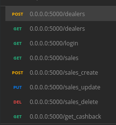

# Desafio Boticário Cahsback

O Boticário tem várias soluções para ajudar seus revendedores(as) a gerir suas finanças e alavancar
suas vendas. Também existem iniciativas para impulsionar as operações de vendas como metas
gameficadas e desconto em grandes quantidades de compras.
Agora queremos criar mais uma solução, e é aí que você entra com seu talento ;)
A oportunidade proposta é criar um sistema de Cashback, onde o valor será disponibilizado como
crédito para a próxima compra da revendedora no Boticário;
Cashback quer dizer “dinheiro de volta”, e funciona de forma simples: o revendedor faz uma
compra e seu benefício vem com a devolução de parte do dinheiro gasto.
Sendo assim o Boticário quer disponibilizar um sistema para seus revendedores(as) cadastrarem
suas compras e acompanhar o retorno de cashback de cada um.

## Pré-requisitos:
- Ambiente Linux 
- Python 3.6
- Docker
- Virtualenv
- unittest 

1) Na raiz do projeto, rode o comando `docker-compose up --build` para buildar o docker com o mongoDB
2) Na raiz do projeto, rode o shell script `./start.sh`. para fazer as instalações das dependecias e startar o flask
3) instalar dependencia `python -m unittest` 

# Rotas
* [Json Postman](boticario.postman_collection.json) - usar para importar no postman

## Endpoint: /dealers
##### Métodos = ['GET', 'POST']
#### GET
O método **GET** retorna uma lista com todos os dealers cadastrados 
##### Retorno: JSON 
##### Authorization JWT: False

---------

#### POST
O método **POST** é usado para criar novos dealers. 
##### Retorno: JSON 
##### Authorization JWT: False
##### corpo requisição Exemplo:
	{
		"nome": <Nome>,
		"cpf": <Somente numero>,
		"email": <email>
		"senha": <senha>
	}
	
---------

## Endpoint: /login
##### Método = ['GET']
O método **GET** retorna o token JWT que deve ser usado no header das proximas rotas (Authorization : 'token_jwt')
##### Retorno: JSON 
##### Authorization JWT: False 	
##### corpo requisição Exemplo
	{
	   "cpf": <Somente numero>,
           "senha": <senha>
	}

---------

## Endpoint: /sales
##### Método = ['GET']
O método **GET** retorna uma lista com todos as sales cadastradas 
##### Retorno: JSON 
##### Authorization JWT: True 

---------

## Endpoint: /sales_delete
##### Método = ['DELETE']
O método **DELETE** deleta a sale informada no campo json 
##### Retorno: JSON 
##### Authorization JWT: True 
##### corpo requisição Exemplo:
    {
        "codigo": <Somente numero>,
        "venda_cpf": <Somente numero>
    }
---------
## Endpoint: /sales_create
##### Método = ['POST']
O método **POST** é usado para criar novas sales. 
##### Retorno: JSON 
##### Authorization JWT: True 
##### corpo requisição Exemplo:
    {
        "codigo": <Somente numero>,
        "valor": <valor decimal com ponto>,
        "data": <data ex 10/10/2020>,
        "venda_cpf": <Somente numero>
    }
---------
## Endpoint: /sales_update
##### Método = ['PUT']
O método **PUT** é usado para alterar sales existentes. 
##### Retorno: JSON 
##### Authorization JWT: True 
##### corpo requisição Exemplo:
    {
        "codigo": <Somente numero>,
        "venda_cpf": <Somente numero>,
        "campos_put" : {
            "codigo": <Somente numero>,
            "valor": <valor decimal com ponto>,
            "data": <data ex 10/10/2020>,
            "venda_cpf": <Somente numero>
            "status": "Aprovado"
        }
    }
---------
## Endpoint: /get_cashback
##### Métodos = ['GET']
O método **GET** retorna o montande de cashback para o cpf 12312312323
##### Retorno: JSON 
 
 
 ---------
## TESTES

* executar o comando `python -m unittest -v testes` para realizar todos os teste
* executar o comando `python -m unittest testes/teste_sales.py` para realizar testes do modulo Sales
* executar o comando `python -m unittest testes/teste_dealer.py` para realizar testes do modulo Dealers

###### material de apoio para realizar os testes  
[ealpython](https://ealpython.com/python-testing/) 
[DocsPython](https://docs.python.org/3/library/unittest.html) 
[medium](https://medium.com/@otaviobn/tdd-com-flask-e-unittest-3f66036a240b) 
 

